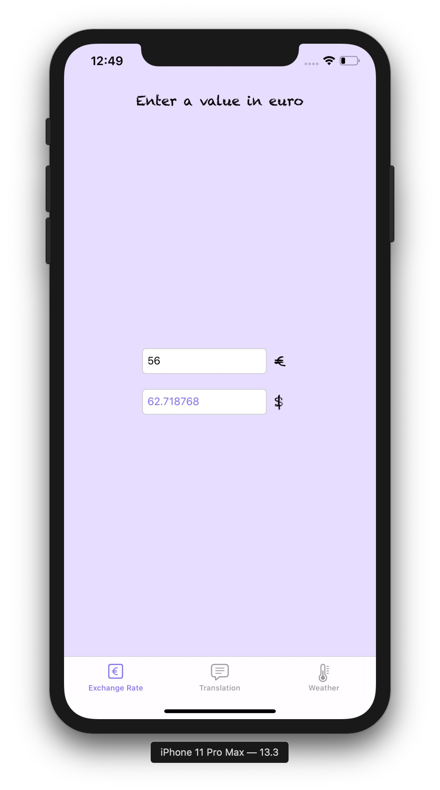
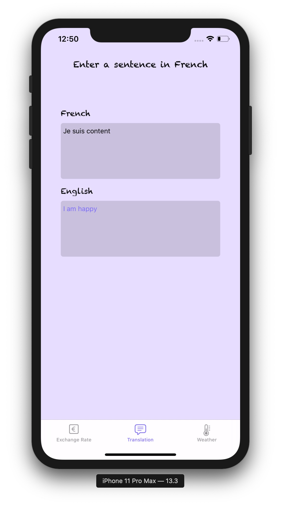
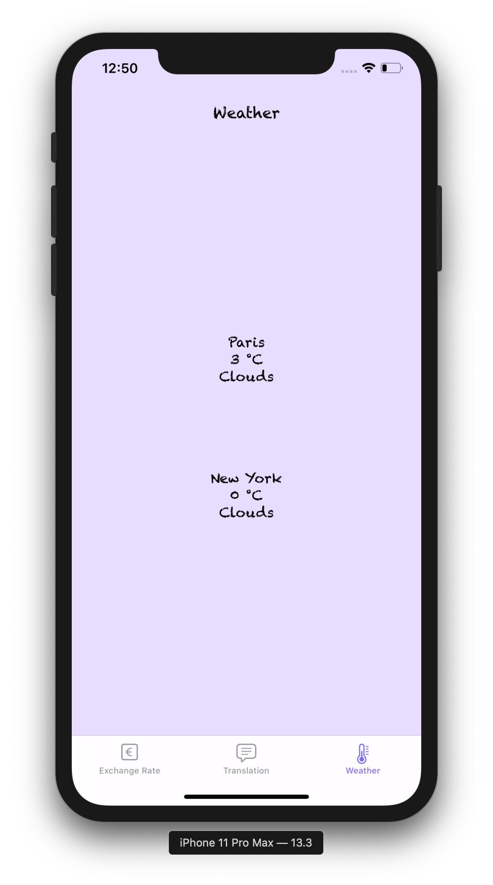

# Le Baluchon

**Le Baluchon** allows users to get the exchange rate from euro to dollar, translate from French to English and get Paris' and New York's weather.

This project is part of the [OpenClassrooms iOS Developer Path](https://openclassrooms.com/en/paths/74-ios-developer).

## Screenshots

    
    
    

## License

The content of this repository is licensed under a [MIT License](LICENSE).
